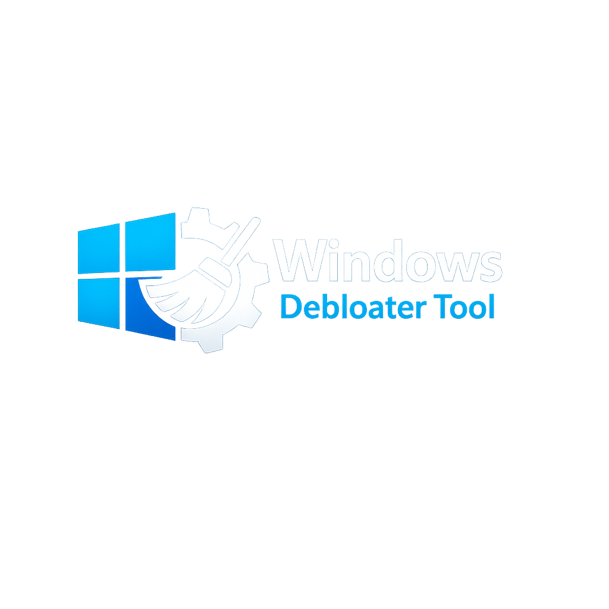
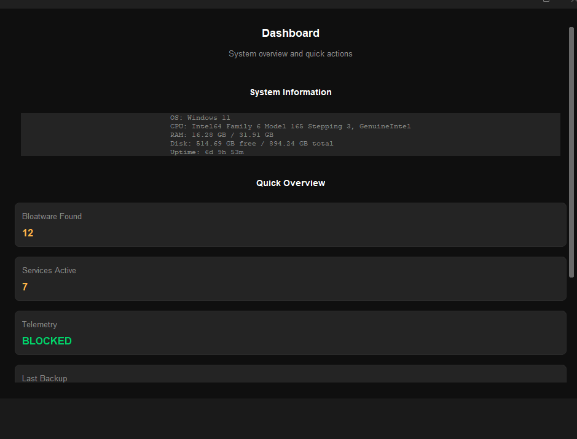
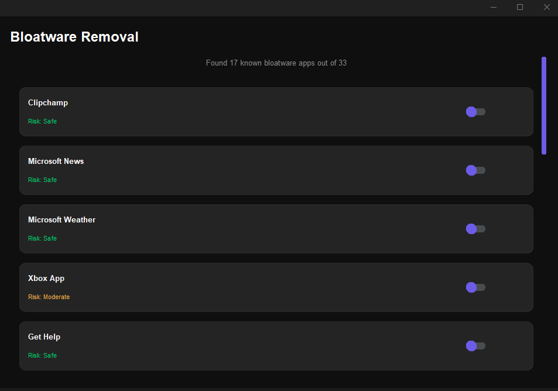

<div align="center">



# WinPurge

### Open-Source Windows Debloater for Windows 11 & Windows 10

Remove bloatware, disable telemetry, and optimize your PC — all from a single modern interface.

A lightweight Python alternative to tools like WinUtil (Chris Titus Tech) and Tiny11,
designed for users who want full control without the complexity.

[](https://www.python.org)
[](LICENSE)
[](https://www.microsoft.com/windows)
[](../../releases)
[](../../stargazers)

<br>

[**Download**](../../releases/latest) · [**Screenshots**](#-screenshots) · [**Features**](#-what-can-winpurge-do) · [**FAQ**](#-faq) · [**Contribute**](#-contributing)

<br>

</div>

---

## Why WinPurge?

Every fresh Windows 11 install comes loaded with apps you never asked for — Clipchamp, Microsoft News, Copilot, Xbox bloat, OEM trialware, and dozens of background services silently eating RAM and sending telemetry.

Most debloater tools are either PowerShell scripts with no GUI, or heavy C# apps tied to a single Windows version. **WinPurge takes a different approach**: a clean Python-based GUI that works on both Windows 10 and Windows 11, with every tweak categorized by risk level so you always know what you're changing.

No hidden scripts. No forced presets. Just a transparent tool that does exactly what you tell it to.

---

## 🖼 Screenshots

| Dashboard | Bloatware Removal |
|:-:|:-:|
|  |  |

---

## ✨ What Can WinPurge Do?

### 🧹 Remove Windows Bloatware
Scan and remove pre-installed Microsoft apps and third-party OEM software (Dell, HP, Lenovo bundles). Covers 50+ known bloatware packages including Clipchamp, Cortana, Microsoft News, Solitaire, Teams consumer, and more.

### 🔒 Harden Privacy
Disable Windows telemetry at every level — registry keys, scheduled tasks, and network endpoints. Block Cortana, Copilot, Windows Recall, activity history, advertising ID, clipboard sync, and Start Menu suggestions.

### ⚙️ Manage Background Services
View all running services with human-readable descriptions and risk levels. Safely disable resource-heavy services like DiagTrack, SysMain, Connected User Experiences, and Windows Error Reporting.

### 🎮 Optimize for Gaming
Apply proven tweaks: enforce Game Mode, disable Game Bar overlay, set High Performance power plan, fix mouse acceleration, disable Nagle's Algorithm for lower network latency, and disable fullscreen optimizations.

### 🌐 Configure Network
Switch DNS with one click (Cloudflare, Google, AdGuard, Quad9), edit the hosts file visually, and block known telemetry domains at the network level.

### 💾 Clean Up Disk Space
Remove temp files, prefetch cache, Windows Update leftovers, thumbnail cache, and Delivery Optimization files. Most users free up **5–20 GB** after a full cleanup.

### 🛡️ Backup & Restore
Every change is logged. Before applying tweaks, WinPurge snapshots your registry keys, service states, and hosts file. One-click restore from any backup.

### 🌍 Multilingual Interface
Full UI translation: **English**, **Deutsch**, **Français**, **Español**, **Polski**.

---

## 🚀 Getting Started

### Option A: Download the Executable (Recommended)

1. Go to [**Releases**](https://github.com/george-pattern/winpurge/releases/latest)
2. Download `WinPurge.exe`
3. Right-click → **Run as Administrator**

No Python needed. No installation. Single portable file.

### Option B: Run from Source

```bash
git clone https://github.com/george-pattern/WinPurge.git
cd WinPurge
pip install -r requirements.txt
python -m winpurge.main
```

### Option C: Build Your Own Executable

```bash
git clone https://github.com/george-pattern/WinPurge.git
cd WinPurge
pip install -r requirements.txt
python build.py
# Output → dist/WinPurge.exe
```

---

## 📋 Requirements

| | Minimum |
|---|---|
| **OS** | Windows 10 (Build 19041+) or Windows 11 |
| **Privileges** | Administrator |
| **RAM** | 512 MB |
| **Disk** | 100 MB |
| **Python** | 3.12+ *(source only)* |

---

## 🛡️ Risk Levels Explained

Not all tweaks are equal. Every option in WinPurge is tagged:

| Level | Meaning | Example |
|:---:|---|---|
| 🟢 **Safe** | No side effects, recommended for everyone | Remove Clipchamp, disable telemetry |
| 🟡 **Moderate** | Minor features may stop working | Disable SysMain, location services |
| 🔴 **Advanced** | May affect functionality, for power users | Disable Windows Error Reporting |

You're always in control — nothing is applied without your confirmation.

---

## 🔄 How It Compares

| Feature | WinPurge | WinUtil (Chris Titus) | Tiny11 | O&O ShutUp10 |
|---|:---:|:---:|:---:|:---:|
| GUI | ✅ Modern | ✅ WPF | ❌ | ✅ Basic |
| Open Source | ✅ MIT | ✅ MIT | ❌ | ❌ |
| Win 10 + Win 11 | ✅ | ✅ | Win 11 only | ✅ |
| Bloatware removal | ✅ | ✅ | Pre-removed | ❌ |
| Privacy hardening | ✅ | ✅ | Partial | ✅ |
| Gaming tweaks | ✅ | ❌ | ❌ | ❌ |
| Backup/Restore | ✅ Auto | Manual | ❌ | ✅ |
| Disk cleanup | ✅ | ❌ | ❌ | ❌ |
| DNS manager | ✅ | ✅ | ❌ | ❌ |
| Multilingual | 5 langs | EN only | EN only | Partial |
| Portable .exe | ✅ | ✅ | ISO | ✅ |
| Python-based | ✅ | ❌ (PS/C#) | ❌ | ❌ (C++) |

WinPurge is not a replacement for these tools — it's an alternative for users who prefer a Python-native, GUI-first approach with granular control and built-in backups.

---

## ❓ FAQ

<details>
<summary><b>Is it safe to use?</b></summary>
Yes. Every tweak is categorized by risk level, and automatic backups are created before any change. You can always restore your previous state with one click.
</details>

<details>
<summary><b>Does it work on Windows 10?</b></summary>
Yes. WinPurge fully supports Windows 10 (Build 19041 and above) and Windows 11, including the latest 24H2 update.
</details>

<details>
<summary><b>Do I need Python installed?</b></summary>
No — if you download the pre-built .exe from Releases. Python 3.12+ is only needed if you run from source.
</details>

<details>
<summary><b>How much disk space will it free?</b></summary>
It depends on your system, but most users see between 5 and 20 GB recovered after running the full cleanup routine.
</details>

<details>
<summary><b>Can I undo all changes?</b></summary>
Yes. Go to the Backup page, select any previous snapshot, and click Restore. Registry keys, services, and hosts file will be reverted.
</details>

<details>
<summary><b>Will Windows Update still work?</b></summary>
Yes. WinPurge does not disable Windows Update by default. Only the Update Delivery Optimization cache is cleared during cleanup.
</details>

<details>
<summary><b>Why Python instead of PowerShell or C#?</b></summary>
Python allows rapid development with a modern GUI (CustomTkinter), easy cross-version Windows support, and a lower barrier for community contributions.
</details>

<details>
<summary><b>Is it detected as malware?</b></summary>
Some antivirus tools flag debloaters because they modify system settings. WinPurge is fully open-source — review every line of code yourself. If flagged, add an exception.
</details>

---

## 🗺 Roadmap

- [ ] Scheduled task manager with toggle UI
- [ ] Custom bloatware list editor
- [ ] Before/after performance benchmark
- [ ] Auto-update checker (GitHub API)
- [ ] CLI mode for scripted deployments
- [ ] Config profiles: import and export settings
- [ ] Portable mode with zero writes outside app folder

---

## 🤝 Contributing

Contributions are welcome. See [CONTRIBUTING.md](CONTRIBUTING.md) for guidelines.

```bash
# Fork → Clone → Branch → Commit → PR
git checkout -b feature/your-feature
git commit -m "Add: your feature description"
git push origin feature/your-feature
```

Translations are especially appreciated — check `locales/` for the JSON format.

---

## 📝 License

[MIT License](LICENSE) — use it, modify it, distribute it freely.

---

## 🙏 Credits

- [CustomTkinter](https://github.com/TomSchimansky/CustomTkinter) — modern Tkinter widgets
- [psutil](https://github.com/giampaolo/psutil) — system information
- Inspired by [Chris Titus WinUtil](https://github.com/ChrisTitusTech/winutil) and community feedback

---

<div align="center">

**If WinPurge helped you, consider leaving a ⭐**

[Download Latest Release](https://github.com/george-pattern/winpurge/releases/latest)

</div>
